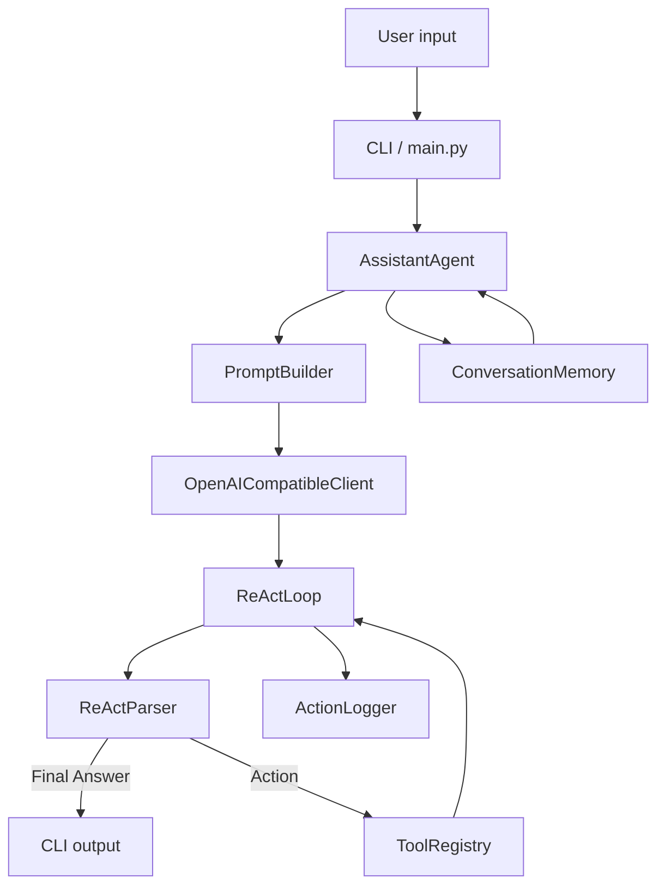

# ReAct Assistant — Documentation

A terminal-first Python assistant that demonstrates a **ReAct (Reason + Act) loop**, tool execution, JSON-backed memory, and structured logging. It talks to any OpenAI-compatible API (OpenRouter, NVIDIA NIM, OpenAI, etc.) and falls back to a mock mode when no API key is present.

---

## Table of Contents

1. [Overview](#1-overview)
2. [Quick Start](#2-quick-start)
3. [Project Structure](#3-project-structure)
4. [Architecture & Data Flow](#4-architecture--data-flow)
5. [Module Reference](#5-module-reference)
   - [config](#51-configpy)
   - [main / __main__](#52-mainpy--__main__py)
   - [llm](#53-llm)
   - [agent](#54-agent)
   - [memory](#55-memory)
   - [tools](#56-tools)
   - [logs](#57-logs)
   - [templates](#58-templates)
   - [utils](#59-utils)
6. [The ReAct Loop](#6-the-react-loop)
7. [CLI Commands](#7-cli-commands)
8. [Environment Variables](#8-environment-variables)
9. [Output Locations](#9-output-locations)
10. [Extending the Project](#10-extending-the-project)

---

## 1. Overview

The assistant works in a **think → act → observe** cycle:

1. The user sends a message.
2. The message is stored in conversation memory.
3. A prompt is assembled from the system prompt, tool list, memory summary, and any prior reasoning (scratchpad).
4. The prompt is sent to the LLM.
5. The response is parsed for `Thought` / `Action` / `Action Input` / `Final Answer`.
6. If an action is requested, the matching tool runs and its output (`Observation`) is fed back into the loop.
7. When a `Final Answer` appears, it is printed and saved to memory.

If the loop exceeds `REACT_MAX_ITERATIONS` without a final answer, it raises a `RuntimeError`.

---

## 2. Quick Start

```powershell
# 1. Create and activate a virtual environment
python -m venv .venv
.\.venv\Scripts\Activate.ps1

# 2. Install dependencies
pip install -r requirements.txt

# 3. Configure .env (see below), then run
python -m react_assistant
```

Run a single prompt without entering the interactive loop:

```powershell
python -m react_assistant --prompt "What is 18 * 49?"
python -m react_assistant --once          # read one prompt from stdin
python -m react_assistant --no-banner    # suppress the startup banner
```

Example `.env`:

```env
OPENROUTER_API_KEY=your_api_key_here
BASE_URL=https://openrouter.ai/api/v1
MODEL=tencent/hy3:free
LLM_USE_MOCK=0
```

The project is **live** when `OPENROUTER_API_KEY` is set and `LLM_USE_MOCK` is `0`/unset; otherwise it runs in **mock** mode.

---

## 3. Project Structure

```
Single-Agent/
├── .env.example              # Template for credentials (copy to .env)
├── .gitignore
├── .gitattributes            # Line-ending & export rules
├── LICENSE                   # MIT
├── README.md                 # Project overview & quick start
├── DOCUMENTATION.md          # This file
├── requirements.txt          # python-dotenv
└── react_assistant/
    ├── __init__.py           # Package marker, __version__ = "0.1.0"
    ├── __main__.py           # Entry point for `python -m react_assistant`
    ├── main.py               # CLI, runtime wiring, commands
    ├── cli/
    │   ├── console.py        # Console: ANSI styling, rules, panels, key/value
    │   └── spinner.py        # Spinner: non-blocking terminal spinner
    ├── config.py             # AppConfig: loads .env into typed settings
    ├── llm/
    │   ├── client.py         # OpenAICompatibleClient (live + mock)
    │   └── models.py         # ChatMessage, LLMResponse, LLMUsage
    ├── agent/
    │   ├── agent.py          # AssistantAgent: orchestrates memory + prompts + loop
    │   ├── parser.py         # ReActParser: extracts Thought/Action/... blocks
    │   ├── prompts.py        # PromptBuilder: assembles system+user messages
    │   └── react_loop.py     # ReActLoop: the core think→act→observe cycle
    ├── memory/
    │   └── memory.py         # ConversationMemory: JSON-backed history
    ├── tools/
    │   ├── registry.py       # ToolRegistry + RunnableTool protocol
    │   ├── calculator.py     # Safe arithmetic via ast
    │   ├── datetime_tool.py  # Current UTC time
    │   └── weather.py        # Placeholder weather tool
    ├── logs/
    │   └── logger.py         # ActionLogger: text + JSONL logs
    ├── templates/
    │   └── system_prompt.txt # Editable system prompt
    └── utils/
        └── helpers.py        # JSON/text IO, timestamps, dir helpers
```

---

## 4. Architecture & Data Flow



Component responsibilities:

| Component | Responsibility |
|-----------|----------------|
| `main.py` | Parses CLI args, builds the runtime, runs commands, drives the prompt loop |
| `config.py` | Reads `.env`, exposes typed `AppConfig` |
| `llm/` | Sends chat requests to an OpenAI-compatible endpoint; provides mock response |
| `agent/` | Builds prompts, runs the ReAct cycle, parses output, ties memory + tools together |
| `memory/` | Persists conversation history to JSON |
| `tools/` | Defines and registers callable tools, dispatches by name/alias |
| `logs/` | Writes human-readable and structured event logs |
| `utils/` | Small IO/timestamp helpers shared across modules |

---

## 5. Module Reference

### 5.1 `config.py`

Defines `AppConfig` and loads settings from the environment.

- `PACKAGE_ROOT`, `PROJECT_ROOT` resolve paths relative to the file.
- `DEFAULT_HISTORY_PATH = <pkg>/memory/history.json`
- `DEFAULT_LOG_DIR = <pkg>/logs`
- `DEFAULT_SYSTEM_PROMPT_PATH = <pkg>/templates/system_prompt.txt`

**`AppConfig.load()`** pulls these variables (with fallbacks):

| Field | Env var(s) | Default |
|-------|-----------|---------|
| `api_key` | `OPENROUTER_API_KEY`, `OPENAI_API_KEY`, `LLM_API_KEY` | `None` |
| `api_base_url` | `BASE_URL`, `OPENROUTER_BASE_URL`, `OPENAI_BASE_URL` | `https://openrouter.ai/api/v1` |
| `model` | `MODEL`, `OPENROUTER_MODEL`, `OPENAI_MODEL` | `gpt-4o-mini` |
| `max_iterations` | `REACT_MAX_ITERATIONS` | `6` |
| `tool_timeout_seconds` | `TOOL_TIMEOUT_SECONDS` | `10` |
| `use_mock_llm` | `LLM_USE_MOCK` ∈ {1,true,yes,on} **or** no API key | `True` if no key |

### 5.2 `main.py` & `__main__.py`

- `__main__.py` simply calls `run_cli()`.
- `build_runtime()` constructs `AppConfig`, `Console`, `ActionLogger`, `ConversationMemory`, `ToolRegistry` (registers `CalculatorTool`, `WeatherTool`, `DateTimeTool`), `PromptBuilder`, `OpenAICompatibleClient`, and `AssistantAgent`.
- `RuntimeContext` dataclass bundles these for passing around.
- `print_banner()` renders a styled header with model, base URL, memory/log paths, and mode (mock/live).
- `run_prompt()` runs the agent behind a `Spinner`, then renders a **Reasoning** block (each iteration's `Thought` / `Action` / `Observation`) when tools were used, followed by a ruled **Final Answer** block with a metadata footer. The final answer is cleaned of any leaked ReAct scaffolding.
- `handle_command()` implements `/help`, `/tools`, `/memory`, `/status`, `/clear`, `/exit`.
- `run_cli()` parses `--prompt`, `--once`, `--no-banner`, `--no-color`, then runs interactively, or reads piped stdin line-by-line.
- Colors are auto-enabled for TTYs and disabled when `NO_COLOR` is set or stdout is not a terminal.

### 5.2b `cli/`

**`console.py` — `Console`**
- Dependency-free ANSI styling that degrades gracefully to plain text.
- Helpers: `bold`, `dim`, `italic`, `red`/`green`/`yellow`/`blue`/`magenta`/`cyan`/`gray`, `rule(title)`, `panel(title, body)`, `key_value(pairs)`, `success`/`warn`/`error`/`info`/`status`.
- Auto-disables color when stdout is not a TTY or `NO_COLOR` is present.

**`spinner.py` — `Spinner`**
- Context-manager spinner shown during blocking model calls; falls back to a single status line when not a TTY. `update(message)` changes the label mid-run.

### 5.3 `llm/`

**`models.py`**
- `ChatMessage(role, content)` — a single chat turn.
- `LLMUsage(prompt_tokens, completion_tokens, total_tokens)` — token accounting.
- `LLMResponse(content, raw, usage)` — wrapped model response.

**`client.py` — `OpenAICompatibleClient`**
- `__init__(api_key, base_url, model, use_mock=False)`.
- `chat(messages)`:
  - If `use_mock`, returns `_mock_response()` (echoes the last user message, advises configuring a key).
  - Otherwise POSTs to `{base_url}/chat/completions` with `temperature=0.2`, `Authorization: Bearer <key>`.
  - Reads `choices[0].message.content` and `usage`; raises `RuntimeError` on HTTP/URL errors.
- Uses only the standard library (`urllib`), so there is **no** hard `openai`/`requests` dependency.

### 5.4 `agent/`

**`agent.py` — `AssistantAgent`**
- Wires `ReActParser` + `ReActLoop`.
- `ask(user_input)` → appends user message to memory, builds messages, runs the loop, saves the final answer to memory, returns `ReActRunResult`.
- `_build_messages()` combines a memory summary with the prompt builder.

**`parser.py` — `ReActParser`**
- `parse(text) -> ParsedAgentOutput` extracts:
  - `Thought` (block)
  - `Action` (single line, `Action: <name>`)
  - `Action Input` (block)
  - `Final Answer` (block)
- Fallback: if no `Final Answer`/`Action` and text is non-empty, the whole text becomes the `final_answer`.
- `_extract_block` reads until the next known label (`Thought:`, `Action:`, `Final Answer:`, `Observation:`) or EOF.

**`prompts.py` — `PromptBuilder`**
- `build(user_input, memory_summary, tools, scratchpad="")` returns `[system, user]` `ChatMessage`s.
- System message = template (`templates/system_prompt.txt`, fallback `_default_prompt()`) + available tool list + memory summary + optional previous reasoning (scratchpad).

**`react_loop.py` — `ReActLoop`**
- `ReActStep(iteration, prompt, model_output, parsed, observation)` records one cycle.
- `ReActRunResult(final_answer, steps, usage)` is the loop's return value.
- `run(messages)`:
  1. For each iteration up to `max_iterations`: send messages (+ scratchpad assistant turn), parse.
  2. `Final Answer` present → return result.
  3. `Action` present → execute tool, append `Observation` to scratchpad, continue.
  4. Neither → return raw content as final answer.
  5. Loop exhausted → raise `RuntimeError`.
- `_execute_tool()` logs `tool_request`/`tool_result`/`tool_error` and returns `ToolExecutionResult.output_text` (errors surfaced as `Tool error: ...`).
- `_append_to_scratchpad()` joins scratchpad + model output + `Observation: ...`.

### 5.5 `memory/`

**`memory.py` — `ConversationMemory`**
- Persists a list of `MemoryRecord(role, content, timestamp)` to JSON.
- `load()`, `save()`, `append(role, content)` (auto-timestamps + saves), `extend(messages)`, `as_messages(max_messages)`, `summary(max_messages=8)`, `clear()`.
- `summary()` feeds prior context into the prompt.

### 5.6 `tools/`

**`registry.py`**
- `RunnableTool` (Protocol): requires `name`, `description`, `aliases`, and `run(input_text="") -> str`.
- `ToolExecutionResult(tool_name, input_text, output_text)`.
- `ToolRegistry`: `register()`, `names()`, `descriptions()`, `resolve(name)` (case-insensitive, alias-aware), `execute(name, input_text)`. Unknown names raise `KeyError`.

**`calculator.py` — `CalculatorTool`**
- `name="calculator"`, aliases `{calc, math, calculator}`.
- Safely evaluates arithmetic using `ast` — only `Constant`, `BinOp` (`+ - * / // % **`), and `UnaryOp` (`+ -`) are allowed. No `eval`, so it is safe against arbitrary code.

**`datetime_tool.py` — `DateTimeTool`**
- `name="datetime"`, aliases `{time, datetime, now}`.
- Returns current UTC time as ISO-8601.

**`weather.py` — `WeatherTool`**
- `name="weather"`, aliases `{forecast, weather}`.
- Phase-1 placeholder; requires a non-empty location and returns a placeholder string.

### 5.7 `logs/`

**`logger.py` — `ActionLogger`**
- Writes to `assistant.log` (human-readable, via `logging`) and `actions.jsonl` (one JSON object per line via `event()`).
- `event(event_type, **payload)` stamps UTC time + type + payload; also logs to the text logger.
- `info(message)` for plain text lines.

### 5.8 `templates/`

**`system_prompt.txt`** — the editable system prompt. It defines the assistant's role, reasoning rules, the exact ReAct response format (`Thought` / `Action` / `Action Input` / `Observation` / `Final Answer`), style guidance, and few-shot examples. Editing this file changes agent behavior without touching code.

### 5.9 `utils/`

**`helpers.py`** — shared utilities:
- `utc_now_iso()` — current UTC timestamp.
- `ensure_parent_dir(path)` — creates parent dirs.
- `read_text` / `write_text` (UTF-8).
- `read_json` / `write_json` (UTF-8, dataclass-aware, indented).

---

## 6. The ReAct Loop

```
User → Memory → PromptBuilder → LLM → Parser
                                  │
                    ┌─────────────┴─────────────┐
              Final Answer                  Action
                    │                           │
              print + save              ToolRegistry.execute
                    │                           │
                    ▼                     Observation ↓
              (done)                append to scratchpad → LLM (next iteration)
```

Each iteration is capped by `REACT_MAX_ITERATIONS` (default 6). Tool errors are caught and returned as observations rather than crashing the loop.

---

## 7. CLI Commands

| Command | Description |
|---------|-------------|
| `/help` | Show local commands |
| `/tools` | List registered tools with descriptions |
| `/memory` | Print recent conversation memory (last 8 turns) |
| `/status` | Print runtime config (model, mode, timeouts, tool list, turn count) |
| `/clear` | Clear conversation history |
| `/` or `/?` | Show the command menu inline |
| `/exit` (`exit`, `quit`, `/quit`) | Quit the assistant |

Also supported non-interactively:
- `--prompt "..."` — single prompt, then exit.
- `--once` — read one prompt from stdin.
- `--no-banner` — suppress the startup banner.
- `--no-color` — force plain (uncolored) output.
- Piped input: `echo "Hi" | python -m react_assistant` processes each line as a prompt or command.

---

## 8. Environment Variables

| Variable | Meaning | Default |
|----------|---------|---------|
| `OPENROUTER_API_KEY` (or `OPENAI_API_KEY`, `LLM_API_KEY`) | API key for the model provider | none |
| `BASE_URL` (or `OPENROUTER_BASE_URL`, `OPENAI_BASE_URL`) | Endpoint base URL | `https://openrouter.ai/api/v1` |
| `MODEL` (or `OPENROUTER_MODEL`, `OPENAI_MODEL`) | Model name | `gpt-4o-mini` |
| `LLM_USE_MOCK` | `1`/`true`/`yes`/`on` forces mock mode | off if key present |
| `REACT_MAX_ITERATIONS` | Max ReAct loop iterations | `6` |
| `TOOL_TIMEOUT_SECONDS` | Tool execution timeout (enforced via thread pool) | `10` |

---

## 9. Output Locations

- **Console**: live prompts and answers.
- `react_assistant/logs/assistant.log`: human-readable activity log.
- `react_assistant/logs/actions.jsonl`: structured event log (one JSON/line).
- `react_assistant/memory/history.json`: conversation history (git-ignored).

---

## 10. Extending the Project

**Add a new tool**
1. Create `react_assistant/tools/<my_tool>.py` with a class exposing `name`, `description`, `aliases`, and `run(input_text: str) -> str`.
2. Register it in `react_assistant/main.py` `build_runtime()`:
   ```python
   from react_assistant.tools.my_tool import MyTool
   tools.register(MyTool())
   ```

**Switch models / providers** — edit `.env` (`BASE_URL`, `MODEL`, key). Any OpenAI-compatible API works.

**Customize behavior** — edit `react_assistant/templates/system_prompt.txt` to change agent instructions without touching code.

**Notes**
- The repo runs in live mode when `OPENROUTER_API_KEY` is set and `LLM_USE_MOCK` is `0` or unset.
- `requirements.txt` only pins `python-dotenv`; the LLM client uses the standard library, so no extra HTTP dependency is required.
